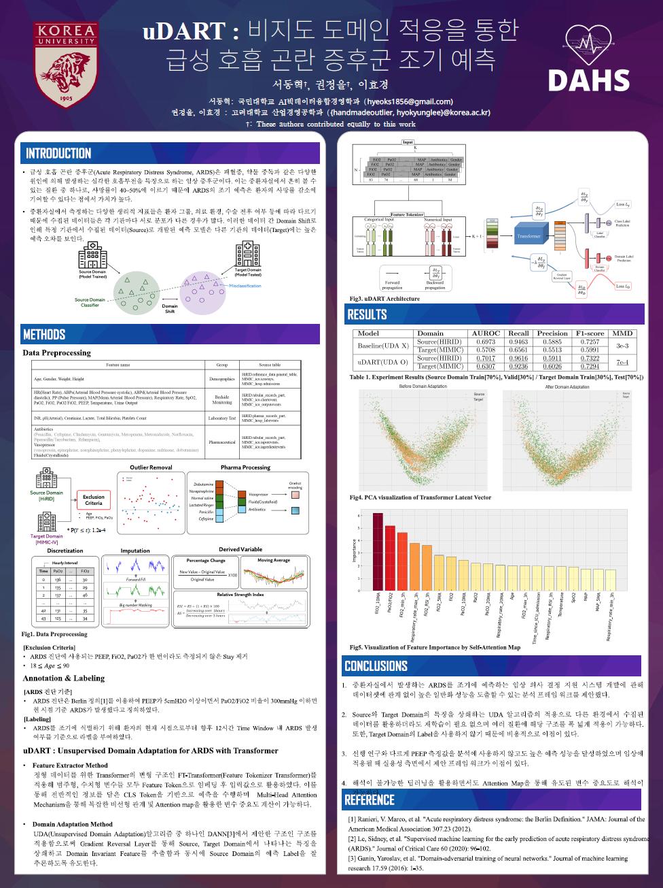

# uDART: Early Prediction for ARDS via Unsupervised Domain Adaptation 
  ### *2024 Spring Conference Korean Society of Medical Informatics Poster Session*

## ❗Check
- `uni`가 붙은 .py파일은 DA를 적용하지 않고 Source로만 학습하는 파일.
각종 하이퍼파라미터들이나 Setting은 `main.py`의 `argparser` 참고.

-  `_uni`는 DA가 적용되지 않은 비교를 위한 것으로 Source Data로만 학습하고 Target Data 평가

-------

## Step 1) Data Preprocess

1) dataset 폴더에 mimic , eicu csv.gz 파일 있는지 확인
2) requriments 파일 실행
3) `preproc.py` 실행 'MIMIC Nums of Columns 123 | eICU Nums of Columns 122' 이렇게 출력되면 정상 실행.
4) `data_cut_off.py` : Cut-Off by Event
-------
## Step 2) Train & Inference 

5) `train.sh` 파일 실행 : `main_uni.py`를 실행하면 DA 적용 X 
6) `test.sh` 파일 실행 : `main_uni.py`를 실행하면 DA 적용 X 
7) `visualize.sh` : Visualize attention map
8) `evaluation.py` : Evaluate trained model
--------
